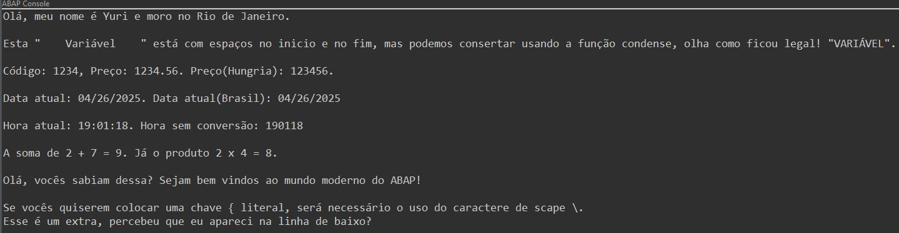

# Código de exemplos de String Template

## O resturado esperado ao executar o código abaixo é:



## Segue o código:
``` abap
CLASS zcl_test_template_string DEFINITION
  PUBLIC
  FINAL
  CREATE PUBLIC .

  PUBLIC SECTION.

    INTERFACES if_oo_adt_classrun .
  PROTECTED SECTION.
  PRIVATE SECTION.
ENDCLASS.


CLASS zcl_test_template_string IMPLEMENTATION.


  METHOD if_oo_adt_classrun~main.
*   Exemplo Básico
    DATA(lv_nome)   = 'Yuri'.
    DATA(lv_cidade) = 'Rio de Janeiro'.
    DATA(lv_msg)    = |Olá, meu nome é { lv_nome } e moro no { lv_cidade }.|.
    out->write( lv_msg ).

    out->write( ` ` ).

*   Uso de funções
    DATA(lv_spaces)   = `    Variável    `.
    lv_msg = |Esta "{ lv_spaces }" está com espaços no inicio e no fim, mas podemos consertar usando a função condense, olha como ficou legal! "{ to_upper( condense( lv_spaces ) ) }".|.
    out->write( lv_msg ).

    out->write( ` ` ).

*    Formatação ALPHA e CURRENCY
    DATA(lv_codigo) = '00001234'.
    DATA(lv_preco)  = 123456.

*    A moeda do Brasil usa 2 decimais em sua representação
*    Já a moeda da Hungria(HUF) não usa decimais na representação de sua moeda
    DATA(lv_resultado) = |Código: { condense( | { lv_codigo ALPHA = OUT } | ) }, Preço: { lv_preco CURRENCY = 'BRL' }. Preço(Hungria): { lv_preco CURRENCY = 'HUF' }.|.
    out->write( lv_resultado ).

    out->write( ` ` ).

*    Formatação DATE = USER e ENVIRONMENT
*    Meu usuário é americano, portanto ao usar DATE = USER, a data ficará MM/DD/YYYY
*    Já o ambiente de testes é brasileiro, portando ao usar DATE = ENVIRONMENT, a data ficará DD/MM/YYYY
    DATA(lv_data_atual) = |Data atual: { cl_abap_context_info=>get_system_date( ) DATE = USER }. Data atual(Brasil): { cl_abap_context_info=>get_system_date( ) DATE = ENVIRONMENT }|.
    out->write( lv_data_atual ).

    out->write( ` ` ).

*    Formatação TIME = ISO
    DATA(lv_hora_atual) = |Hora atual: { cl_abap_context_info=>get_system_time( ) TIME = ISO }. Hora sem conversão: { cl_abap_context_info=>get_system_time( ) }|.
    out->write( lv_hora_atual ).

    out->write( ` ` ).

*    Expressões dentro da string
    DATA(lv_expressao) = |A soma de 2 + 7 = { 2 + 7 }. Já o produto 2 x 4 = { 2 * 4 }.|.
    out->write( lv_expressao ).

    out->write( ` ` ).

*    Exemplo de Multilinhas
    lv_msg = |Olá, vocês sabiam dessa? | &
             |Sejam bem vindos ao mundo moderno do ABAP!|.
    out->write( lv_msg ).

    out->write( ` ` ).

*    Escape de chaves literais com \
    lv_msg = |Se vocês quiserem colocar uma chave \{ literal, será necessário o uso do caractere de scape \\. \nEsse é um extra, percebeu que eu apareci na linha de baixo?|.
    out->write( lv_msg ).

    out->write( ` ` ).
  ENDMETHOD.
ENDCLASS.
```